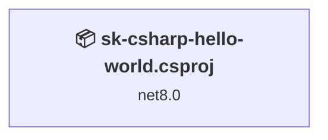
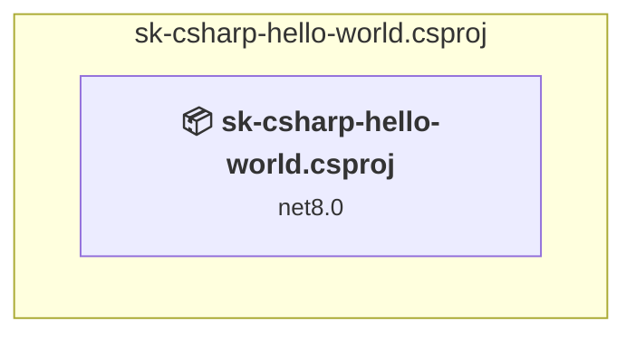

# Projects and dependencies analysis

This document provides a comprehensive overview of the projects and their dependencies in the context of upgrading to .NETCoreApp,Version=v10.0.

## Table of Contents

- [Executive Summary](#executive-Summary)
  - [Highlevel Metrics](#highlevel-metrics)
  - [Projects Compatibility](#projects-compatibility)
  - [Package Compatibility](#package-compatibility)
  - [API Compatibility](#api-compatibility)
- [Aggregate NuGet packages details](#aggregate-nuget-packages-details)
- [Top API Migration Challenges](#top-api-migration-challenges)
  - [Technologies and Features](#technologies-and-features)
  - [Most Frequent API Issues](#most-frequent-api-issues)
- [Projects Relationship Graph](#projects-relationship-graph)
- [Project Details](#project-details)

  - [sk-csharp-hello-world.csproj](#sk-csharp-hello-worldcsproj)

## Executive Summary

### Highlevel Metrics

| Metric | Count | Status |
| :--- | :---: | :--- |
| Total Projects | 1 | All require upgrade |
| Total NuGet Packages | 6 | 3 need upgrade |
| Total Code Files | 6 |  |
| Total Code Files with Incidents | 2 |  |
| Total Lines of Code | 239 |  |
| Total Number of Issues | 6 |  |
| Estimated LOC to modify | 2+ | at least 0,8% of codebase |

### Projects Compatibility

| Project | Target Framework | Difficulty | Package Issues | API Issues | Est. LOC Impact | Description |
| :--- | :---: | :---: | :---: | :---: | :---: | :--- |
| [sk-csharp-hello-world.csproj](#sk-csharp-hello-worldcsproj) | net8.0 | 🟢 Low | 3 | 2 | 2+ | DotNetCoreApp, Sdk Style = True |

### Package Compatibility

| Status | Count | Percentage |
| :--- | :---: | :---: |
| ✅ Compatible | 3 | 50,0% |
| ⚠️ Incompatible | 0 | 0,0% |
| 🔄 Upgrade Recommended | 3 | 50,0% |
| ***Total NuGet Packages*** | ***6*** | ***100%*** |

### API Compatibility

| Category | Count | Impact |
| :--- | :---: | :--- |
| 🔴 Binary Incompatible | 2 | High - Require code changes |
| 🟡 Source Incompatible | 0 | Medium - Needs re-compilation and potential conflicting API error fixing |
| 🔵 Behavioral change | 0 | Low - Behavioral changes that may require testing at runtime |
| ✅ Compatible | 261 |  |
| ***Total APIs Analyzed*** | ***263*** |  |

## Aggregate NuGet packages details

| Package | Current Version | Suggested Version | Projects | Description |
| :--- | :---: | :---: | :--- | :--- |
| Microsoft.Extensions.Configuration.UserSecrets | 8.0.0 | 10.0.5 | [sk-csharp-hello-world.csproj](#sk-csharp-hello-worldcsproj) | NuGet package upgrade is recommended |
| Microsoft.Extensions.Logging.Console | 6.0.0 | 10.0.5 | [sk-csharp-hello-world.csproj](#sk-csharp-hello-worldcsproj) | NuGet package upgrade is recommended |
| Microsoft.Extensions.Logging.Debug | 6.0.0 | 10.0.5 | [sk-csharp-hello-world.csproj](#sk-csharp-hello-worldcsproj) | NuGet package upgrade is recommended |
| Microsoft.SemanticKernel | 1.0.1 |  | [sk-csharp-hello-world.csproj](#sk-csharp-hello-worldcsproj) | ✅Compatible |
| Microsoft.SemanticKernel.PromptTemplates.Handlebars | 1.0.1 |  | [sk-csharp-hello-world.csproj](#sk-csharp-hello-worldcsproj) | ✅Compatible |
| Microsoft.SemanticKernel.Yaml | 1.0.1 |  | [sk-csharp-hello-world.csproj](#sk-csharp-hello-worldcsproj) | ✅Compatible |

## Top API Migration Challenges

### Technologies and Features

| Technology | Issues | Percentage | Migration Path |
| :--- | :---: | :---: | :--- |

### Most Frequent API Issues

| API | Count | Percentage | Category |
| :--- | :---: | :---: | :--- |
| M:Microsoft.Extensions.Configuration.ConfigurationBinder.Get''1(Microsoft.Extensions.Configuration.IConfiguration) | 2 | 100,0% | Binary Incompatible |

## Projects Relationship Graph

Legend:
📦 SDK-style project
⚙️ Classic project

## Project Details

### sk-csharp-hello-world.csproj

#### Project Info

- **Current Target Framework:** net8.0
- **Proposed Target Framework:** net10.0
- **SDK-style**: True
- **Project Kind:** DotNetCoreApp
- **Dependencies**: 0
- **Dependants**: 0
- **Number of Files**: 7
- **Number of Files with Incidents**: 2
- **Lines of Code**: 239
- **Estimated LOC to modify**: 2+ (at least 0,8% of the project)

#### Dependency Graph

Legend:
📦 SDK-style project
⚙️ Classic project

### API Compatibility

| Category | Count | Impact |
| :--- | :---: | :--- |
| 🔴 Binary Incompatible | 2 | High - Require code changes |
| 🟡 Source Incompatible | 0 | Medium - Needs re-compilation and potential conflicting API error fixing |
| 🔵 Behavioral change | 0 | Low - Behavioral changes that may require testing at runtime |
| ✅ Compatible | 261 |  |
| ***Total APIs Analyzed*** | ***263*** |  |

