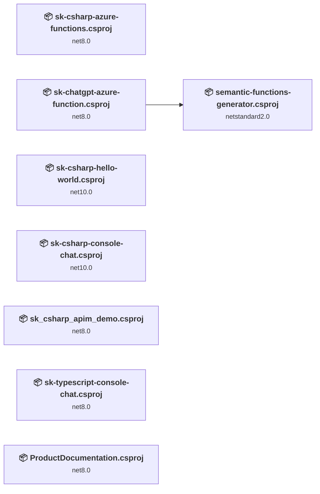
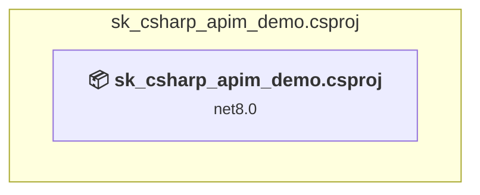
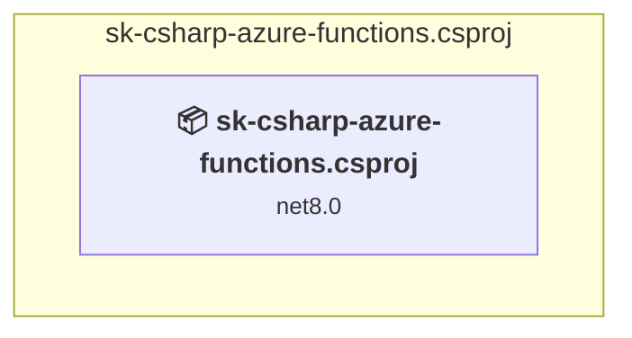
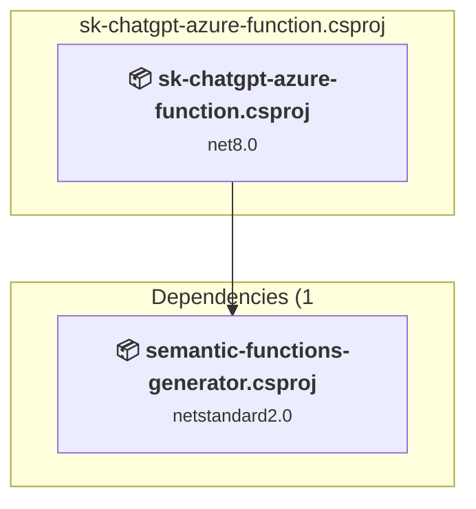
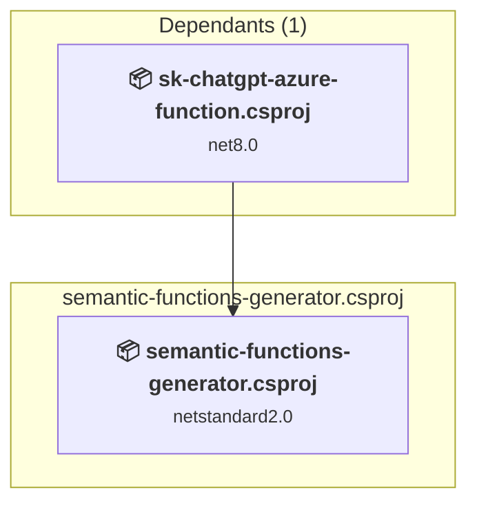
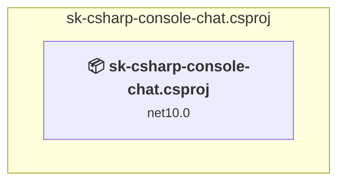
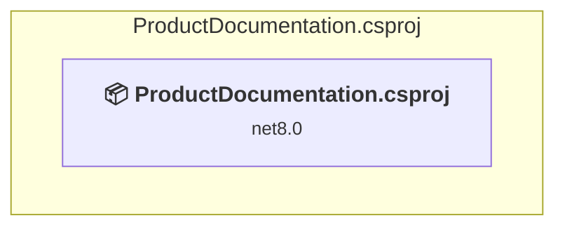
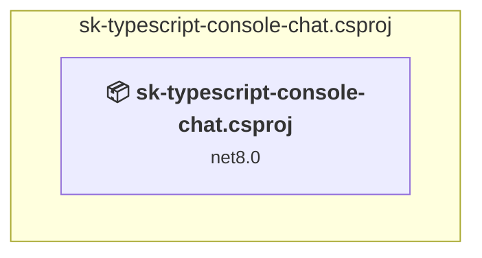

# Projects and dependencies analysis

This document provides a comprehensive overview of the projects and their dependencies in the context of upgrading to .NETCoreApp,Version=v10.0.

## Table of Contents

- [Executive Summary](#executive-Summary)
  - [Highlevel Metrics](#highlevel-metrics)
  - [Projects Compatibility](#projects-compatibility)
  - [Package Compatibility](#package-compatibility)
  - [API Compatibility](#api-compatibility)
- [Aggregate NuGet packages details](#aggregate-nuget-packages-details)
- [Top API Migration Challenges](#top-api-migration-challenges)
  - [Technologies and Features](#technologies-and-features)
  - [Most Frequent API Issues](#most-frequent-api-issues)
- [Projects Relationship Graph](#projects-relationship-graph)
- [Project Details](#project-details)

  - [sk_csharp_apim_demo\sk_csharp_apim_demo.csproj](#sk_csharp_apim_demosk_csharp_apim_democsproj)
  - [sk-csharp-azure-functions\sk-csharp-azure-functions.csproj](#sk-csharp-azure-functionssk-csharp-azure-functionscsproj)
  - [sk-csharp-chatgpt-plugin\azure-function\sk-chatgpt-azure-function.csproj](#sk-csharp-chatgpt-pluginazure-functionsk-chatgpt-azure-functioncsproj)
  - [sk-csharp-chatgpt-plugin\semantic-functions-generator\semantic-functions-generator.csproj](#sk-csharp-chatgpt-pluginsemantic-functions-generatorsemantic-functions-generatorcsproj)
  - [sk-csharp-console-chat\sk-csharp-console-chat.csproj](#sk-csharp-console-chatsk-csharp-console-chatcsproj)
  - [sk-csharp-hello-world\sk-csharp-hello-world.csproj](#sk-csharp-hello-worldsk-csharp-hello-worldcsproj)
  - [sk-process-framework\dotnet\ProductDocumentation\ProductDocumentation.csproj](#sk-process-frameworkdotnetproductdocumentationproductdocumentationcsproj)
  - [sk-typescript-console-chat\sk-typescript-console-chat.csproj](#sk-typescript-console-chatsk-typescript-console-chatcsproj)

## Executive Summary

### Highlevel Metrics

| Metric | Count | Status |
| :--- | :---: | :--- |
| Total Projects | 8 | 6 require upgrade |
| Total NuGet Packages | 27 | 8 need upgrade |
| Total Code Files | 40 |  |
| Total Code Files with Incidents | 12 |  |
| Total Lines of Code | 1713 |  |
| Total Number of Issues | 31 |  |
| Estimated LOC to modify | 10+ | at least 0,6% of codebase |

### Projects Compatibility

| Project | Target Framework | Difficulty | Package Issues | API Issues | Est. LOC Impact | Description |
| :--- | :---: | :---: | :---: | :---: | :---: | :--- |
| [sk_csharp_apim_demo\sk_csharp_apim_demo.csproj](#sk_csharp_apim_demosk_csharp_apim_democsproj) | net8.0 | 🟢 Low | 3 | 1 | 1+ | DotNetCoreApp, Sdk Style = True |
| [sk-csharp-azure-functions\sk-csharp-azure-functions.csproj](#sk-csharp-azure-functionssk-csharp-azure-functionscsproj) | net8.0 | 🟢 Low | 5 | 4 | 4+ | AzureFunctions, Sdk Style = True |
| [sk-csharp-chatgpt-plugin\azure-function\sk-chatgpt-azure-function.csproj](#sk-csharp-chatgpt-pluginazure-functionsk-chatgpt-azure-functioncsproj) | net8.0 | 🟢 Low | 5 | 5 | 5+ | AzureFunctions, Sdk Style = True |
| [sk-csharp-chatgpt-plugin\semantic-functions-generator\semantic-functions-generator.csproj](#sk-csharp-chatgpt-pluginsemantic-functions-generatorsemantic-functions-generatorcsproj) | netstandard2.0 | 🟢 Low | 1 | 0 |  | ClassLibrary, Sdk Style = True |
| [sk-csharp-console-chat\sk-csharp-console-chat.csproj](#sk-csharp-console-chatsk-csharp-console-chatcsproj) | net10.0 | ✅ None | 0 | 0 |  | DotNetCoreApp, Sdk Style = True |
| [sk-csharp-hello-world\sk-csharp-hello-world.csproj](#sk-csharp-hello-worldsk-csharp-hello-worldcsproj) | net10.0 | ✅ None | 0 | 0 |  | DotNetCoreApp, Sdk Style = True |
| [sk-process-framework\dotnet\ProductDocumentation\ProductDocumentation.csproj](#sk-process-frameworkdotnetproductdocumentationproductdocumentationcsproj) | net8.0 | 🟢 Low | 0 | 0 |  | ClassLibrary, Sdk Style = True |
| [sk-typescript-console-chat\sk-typescript-console-chat.csproj](#sk-typescript-console-chatsk-typescript-console-chatcsproj) | net8.0 | 🟢 Low | 0 | 0 |  | ClassLibrary, Sdk Style = True |

### Package Compatibility

| Status | Count | Percentage |
| :--- | :---: | :---: |
| ✅ Compatible | 19 | 70,4% |
| ⚠️ Incompatible | 1 | 3,7% |
| 🔄 Upgrade Recommended | 7 | 25,9% |
| ***Total NuGet Packages*** | ***27*** | ***100%*** |

### API Compatibility

| Category | Count | Impact |
| :--- | :---: | :--- |
| 🔴 Binary Incompatible | 3 | High - Require code changes |
| 🟡 Source Incompatible | 0 | Medium - Needs re-compilation and potential conflicting API error fixing |
| 🔵 Behavioral change | 7 | Low - Behavioral changes that may require testing at runtime |
| ✅ Compatible | 1153 |  |
| ***Total APIs Analyzed*** | ***1163*** |  |

## Aggregate NuGet packages details

| Package | Current Version | Suggested Version | Projects | Description |
| :--- | :---: | :---: | :--- | :--- |
| Azure.Identity | 1.13.2 |  | [sk_csharp_apim_demo.csproj](#sk_csharp_apim_demosk_csharp_apim_democsproj) | ⚠️NuGet package is deprecated |
| Microsoft.Azure.Functions.Worker | 1.18.0 | 2.51.0 | [sk-chatgpt-azure-function.csproj](#sk-csharp-chatgpt-pluginazure-functionsk-chatgpt-azure-functioncsproj) [sk-csharp-azure-functions.csproj](#sk-csharp-azure-functionssk-csharp-azure-functionscsproj) | NuGet package upgrade is recommended |
| Microsoft.Azure.Functions.Worker.Extensions.Http | 3.0.13 | 3.3.0 | [sk-chatgpt-azure-function.csproj](#sk-csharp-chatgpt-pluginazure-functionsk-chatgpt-azure-functioncsproj) [sk-csharp-azure-functions.csproj](#sk-csharp-azure-functionssk-csharp-azure-functionscsproj) | NuGet package upgrade is recommended |
| Microsoft.Azure.Functions.Worker.Extensions.OpenApi | 2.0.0-preview2 |  | [sk-chatgpt-azure-function.csproj](#sk-csharp-chatgpt-pluginazure-functionsk-chatgpt-azure-functioncsproj) [sk-csharp-azure-functions.csproj](#sk-csharp-azure-functionssk-csharp-azure-functionscsproj) | ✅Compatible |
| Microsoft.Azure.Functions.Worker.Sdk | 1.12.0 | 2.0.7 | [sk-chatgpt-azure-function.csproj](#sk-csharp-chatgpt-pluginazure-functionsk-chatgpt-azure-functioncsproj) [sk-csharp-azure-functions.csproj](#sk-csharp-azure-functionssk-csharp-azure-functionscsproj) | NuGet package upgrade is recommended |
| Microsoft.Azure.WebJobs.Extensions.OpenApi | 2.0.0-preview2 |  | [sk-chatgpt-azure-function.csproj](#sk-csharp-chatgpt-pluginazure-functionsk-chatgpt-azure-functioncsproj) [sk-csharp-azure-functions.csproj](#sk-csharp-azure-functionssk-csharp-azure-functionscsproj) | NuGet package functionality is included with framework reference |
| Microsoft.CodeAnalysis | 4.7.0 |  | [sk-chatgpt-azure-function.csproj](#sk-csharp-chatgpt-pluginazure-functionsk-chatgpt-azure-functioncsproj) | ✅Compatible |
| Microsoft.CodeAnalysis.Common | 3.11.0 |  | [semantic-functions-generator.csproj](#sk-csharp-chatgpt-pluginsemantic-functions-generatorsemantic-functions-generatorcsproj) | ✅Compatible |
| Microsoft.CodeAnalysis.CSharp | 3.11.0 |  | [semantic-functions-generator.csproj](#sk-csharp-chatgpt-pluginsemantic-functions-generatorsemantic-functions-generatorcsproj) | ✅Compatible |
| Microsoft.Extensions.Configuration.UserSecrets | 10.0.5 |  | [sk-csharp-console-chat.csproj](#sk-csharp-console-chatsk-csharp-console-chatcsproj) [sk-csharp-hello-world.csproj](#sk-csharp-hello-worldsk-csharp-hello-worldcsproj) | ✅Compatible |
| Microsoft.Extensions.Configuration.UserSecrets | 6.0.1 | 10.0.5 | [sk-chatgpt-azure-function.csproj](#sk-csharp-chatgpt-pluginazure-functionsk-chatgpt-azure-functioncsproj) [sk-csharp-azure-functions.csproj](#sk-csharp-azure-functionssk-csharp-azure-functionscsproj) | NuGet package upgrade is recommended |
| Microsoft.Extensions.Hosting | 10.0.5 |  | [sk-csharp-console-chat.csproj](#sk-csharp-console-chatsk-csharp-console-chatcsproj) | ✅Compatible |
| Microsoft.Extensions.Http.Resilience | 10.4.0 |  | [sk-csharp-console-chat.csproj](#sk-csharp-console-chatsk-csharp-console-chatcsproj) | ✅Compatible |
| Microsoft.Extensions.Logging.Console | 10.0.5 |  | [sk-csharp-hello-world.csproj](#sk-csharp-hello-worldsk-csharp-hello-worldcsproj) | ✅Compatible |
| Microsoft.Extensions.Logging.Console | 6.0.0 | 10.0.5 | [sk_csharp_apim_demo.csproj](#sk_csharp_apim_demosk_csharp_apim_democsproj) | NuGet package upgrade is recommended |
| Microsoft.Extensions.Logging.Debug | 10.0.5 |  | [sk-csharp-hello-world.csproj](#sk-csharp-hello-worldsk-csharp-hello-worldcsproj) | ✅Compatible |
| Microsoft.Extensions.Logging.Debug | 6.0.0 | 10.0.5 | [sk_csharp_apim_demo.csproj](#sk_csharp_apim_demosk_csharp_apim_democsproj) | NuGet package upgrade is recommended |
| Microsoft.JavaScript.NodeApi.Generator | 0.9.11 |  | [sk-typescript-console-chat.csproj](#sk-typescript-console-chatsk-typescript-console-chatcsproj) | ✅Compatible |
| Microsoft.SemanticKernel | 0.19.230804.2-preview |  | [sk_csharp_apim_demo.csproj](#sk_csharp_apim_demosk_csharp_apim_democsproj) [sk-chatgpt-azure-function.csproj](#sk-csharp-chatgpt-pluginazure-functionsk-chatgpt-azure-functioncsproj) [sk-csharp-azure-functions.csproj](#sk-csharp-azure-functionssk-csharp-azure-functionscsproj) | ✅Compatible |
| Microsoft.SemanticKernel | 0.24.230912.2-preview |  | [sk-typescript-console-chat.csproj](#sk-typescript-console-chatsk-typescript-console-chatcsproj) | ✅Compatible |
| Microsoft.SemanticKernel | 1.0.1 |  | [sk-csharp-hello-world.csproj](#sk-csharp-hello-worldsk-csharp-hello-worldcsproj) | ✅Compatible |
| Microsoft.SemanticKernel | 1.74.0 |  | [sk-csharp-console-chat.csproj](#sk-csharp-console-chatsk-csharp-console-chatcsproj) | ✅Compatible |
| Microsoft.SemanticKernel.Process.Core | 1.51.0-alpha |  | [ProductDocumentation.csproj](#sk-process-frameworkdotnetproductdocumentationproductdocumentationcsproj) | ✅Compatible |
| Microsoft.SemanticKernel.PromptTemplates.Handlebars | 1.0.1 |  | [sk-csharp-hello-world.csproj](#sk-csharp-hello-worldsk-csharp-hello-worldcsproj) | ✅Compatible |
| Microsoft.SemanticKernel.Yaml | 1.0.1 |  | [sk-csharp-hello-world.csproj](#sk-csharp-hello-worldsk-csharp-hello-worldcsproj) | ✅Compatible |
| NETStandard.Library | 2.0.3 |  | [semantic-functions-generator.csproj](#sk-csharp-chatgpt-pluginsemantic-functions-generatorsemantic-functions-generatorcsproj) | ✅Compatible |
| Newtonsoft.Json | 13.0.3 | 13.0.4 | [semantic-functions-generator.csproj](#sk-csharp-chatgpt-pluginsemantic-functions-generatorsemantic-functions-generatorcsproj) | NuGet package upgrade is recommended |

## Top API Migration Challenges

### Technologies and Features

| Technology | Issues | Percentage | Migration Path |
| :--- | :---: | :---: | :--- |

### Most Frequent API Issues

| API | Count | Percentage | Category |
| :--- | :---: | :---: | :--- |
| M:Microsoft.Extensions.Configuration.ConfigurationBinder.Get''1(Microsoft.Extensions.Configuration.IConfiguration) | 3 | 30,0% | Binary Incompatible |
| T:System.Uri | 3 | 30,0% | Behavioral Change |
| M:Microsoft.Extensions.Logging.ConsoleLoggerExtensions.AddConsole(Microsoft.Extensions.Logging.ILoggingBuilder) | 2 | 20,0% | Behavioral Change |
| T:Microsoft.Extensions.Hosting.HostBuilder | 2 | 20,0% | Behavioral Change |

## Projects Relationship Graph

Legend:
📦 SDK-style project
⚙️ Classic project

## Project Details

### sk_csharp_apim_demo\sk_csharp_apim_demo.csproj

#### Project Info

- **Current Target Framework:** net8.0
- **Proposed Target Framework:** net10.0
- **SDK-style**: True
- **Project Kind:** DotNetCoreApp
- **Dependencies**: 0
- **Dependants**: 0
- **Number of Files**: 4
- **Number of Files with Incidents**: 2
- **Lines of Code**: 69
- **Estimated LOC to modify**: 1+ (at least 1,4% of the project)

#### Dependency Graph

Legend:
📦 SDK-style project
⚙️ Classic project

### API Compatibility

| Category | Count | Impact |
| :--- | :---: | :--- |
| 🔴 Binary Incompatible | 0 | High - Require code changes |
| 🟡 Source Incompatible | 0 | Medium - Needs re-compilation and potential conflicting API error fixing |
| 🔵 Behavioral change | 1 | Low - Behavioral changes that may require testing at runtime |
| ✅ Compatible | 85 |  |
| ***Total APIs Analyzed*** | ***86*** |  |

### sk-csharp-azure-functions\sk-csharp-azure-functions.csproj

#### Project Info

- **Current Target Framework:** net8.0
- **Proposed Target Framework:** net10.0
- **SDK-style**: True
- **Project Kind:** AzureFunctions
- **Dependencies**: 0
- **Dependants**: 0
- **Number of Files**: 11
- **Number of Files with Incidents**: 3
- **Lines of Code**: 338
- **Estimated LOC to modify**: 4+ (at least 1,2% of the project)

#### Dependency Graph

Legend:
📦 SDK-style project
⚙️ Classic project

### API Compatibility

| Category | Count | Impact |
| :--- | :---: | :--- |
| 🔴 Binary Incompatible | 2 | High - Require code changes |
| 🟡 Source Incompatible | 0 | Medium - Needs re-compilation and potential conflicting API error fixing |
| 🔵 Behavioral change | 2 | Low - Behavioral changes that may require testing at runtime |
| ✅ Compatible | 392 |  |
| ***Total APIs Analyzed*** | ***396*** |  |

### sk-csharp-chatgpt-plugin\azure-function\sk-chatgpt-azure-function.csproj

#### Project Info

- **Current Target Framework:** net8.0
- **Proposed Target Framework:** net10.0
- **SDK-style**: True
- **Project Kind:** AzureFunctions
- **Dependencies**: 1
- **Dependants**: 0
- **Number of Files**: 14
- **Number of Files with Incidents**: 4
- **Lines of Code**: 437
- **Estimated LOC to modify**: 5+ (at least 1,1% of the project)

#### Dependency Graph

Legend:
📦 SDK-style project
⚙️ Classic project

### API Compatibility

| Category | Count | Impact |
| :--- | :---: | :--- |
| 🔴 Binary Incompatible | 1 | High - Require code changes |
| 🟡 Source Incompatible | 0 | Medium - Needs re-compilation and potential conflicting API error fixing |
| 🔵 Behavioral change | 4 | Low - Behavioral changes that may require testing at runtime |
| ✅ Compatible | 421 |  |
| ***Total APIs Analyzed*** | ***426*** |  |

### sk-csharp-chatgpt-plugin\semantic-functions-generator\semantic-functions-generator.csproj

#### Project Info

- **Current Target Framework:** netstandard2.0✅
- **SDK-style**: True
- **Project Kind:** ClassLibrary
- **Dependencies**: 0
- **Dependants**: 1
- **Number of Files**: 3
- **Number of Files with Incidents**: 1
- **Lines of Code**: 262
- **Estimated LOC to modify**: 0+ (at least 0,0% of the project)

#### Dependency Graph

Legend:
📦 SDK-style project
⚙️ Classic project

### API Compatibility

| Category | Count | Impact |
| :--- | :---: | :--- |
| 🔴 Binary Incompatible | 0 | High - Require code changes |
| 🟡 Source Incompatible | 0 | Medium - Needs re-compilation and potential conflicting API error fixing |
| 🔵 Behavioral change | 0 | Low - Behavioral changes that may require testing at runtime |
| ✅ Compatible | 213 |  |
| ***Total APIs Analyzed*** | ***213*** |  |

### sk-csharp-console-chat\sk-csharp-console-chat.csproj

#### Project Info

- **Current Target Framework:** net10.0✅
- **SDK-style**: True
- **Project Kind:** DotNetCoreApp
- **Dependencies**: 0
- **Dependants**: 0
- **Number of Files**: 6
- **Lines of Code**: 286
- **Estimated LOC to modify**: 0+ (at least 0,0% of the project)

#### Dependency Graph

Legend:
📦 SDK-style project
⚙️ Classic project

### API Compatibility

| Category | Count | Impact |
| :--- | :---: | :--- |
| 🔴 Binary Incompatible | 0 | High - Require code changes |
| 🟡 Source Incompatible | 0 | Medium - Needs re-compilation and potential conflicting API error fixing |
| 🔵 Behavioral change | 0 | Low - Behavioral changes that may require testing at runtime |
| ✅ Compatible | 0 |  |
| ***Total APIs Analyzed*** | ***0*** |  |

### sk-csharp-hello-world\sk-csharp-hello-world.csproj

#### Project Info

- **Current Target Framework:** net10.0✅
- **SDK-style**: True
- **Project Kind:** DotNetCoreApp
- **Dependencies**: 0
- **Dependants**: 0
- **Number of Files**: 7
- **Lines of Code**: 239
- **Estimated LOC to modify**: 0+ (at least 0,0% of the project)

#### Dependency Graph

Legend:
📦 SDK-style project
⚙️ Classic project

### API Compatibility

| Category | Count | Impact |
| :--- | :---: | :--- |
| 🔴 Binary Incompatible | 0 | High - Require code changes |
| 🟡 Source Incompatible | 0 | Medium - Needs re-compilation and potential conflicting API error fixing |
| 🔵 Behavioral change | 0 | Low - Behavioral changes that may require testing at runtime |
| ✅ Compatible | 0 |  |
| ***Total APIs Analyzed*** | ***0*** |  |

### sk-process-framework\dotnet\ProductDocumentation\ProductDocumentation.csproj

#### Project Info

- **Current Target Framework:** net8.0
- **Proposed Target Framework:** net10.0
- **SDK-style**: True
- **Project Kind:** ClassLibrary
- **Dependencies**: 0
- **Dependants**: 0
- **Number of Files**: 3
- **Number of Files with Incidents**: 1
- **Lines of Code**: 82
- **Estimated LOC to modify**: 0+ (at least 0,0% of the project)

#### Dependency Graph

Legend:
📦 SDK-style project
⚙️ Classic project

### API Compatibility

| Category | Count | Impact |
| :--- | :---: | :--- |
| 🔴 Binary Incompatible | 0 | High - Require code changes |
| 🟡 Source Incompatible | 0 | Medium - Needs re-compilation and potential conflicting API error fixing |
| 🔵 Behavioral change | 0 | Low - Behavioral changes that may require testing at runtime |
| ✅ Compatible | 42 |  |
| ***Total APIs Analyzed*** | ***42*** |  |

### sk-typescript-console-chat\sk-typescript-console-chat.csproj

#### Project Info

- **Current Target Framework:** net8.0
- **Proposed Target Framework:** net10.0
- **SDK-style**: True
- **Project Kind:** ClassLibrary
- **Dependencies**: 0
- **Dependants**: 0
- **Number of Files**: 0
- **Number of Files with Incidents**: 1
- **Lines of Code**: 0
- **Estimated LOC to modify**: 0+ (at least 0,0% of the project)

#### Dependency Graph

Legend:
📦 SDK-style project
⚙️ Classic project

### API Compatibility

| Category | Count | Impact |
| :--- | :---: | :--- |
| 🔴 Binary Incompatible | 0 | High - Require code changes |
| 🟡 Source Incompatible | 0 | Medium - Needs re-compilation and potential conflicting API error fixing |
| 🔵 Behavioral change | 0 | Low - Behavioral changes that may require testing at runtime |
| ✅ Compatible | 0 |  |
| ***Total APIs Analyzed*** | ***0*** |  |

